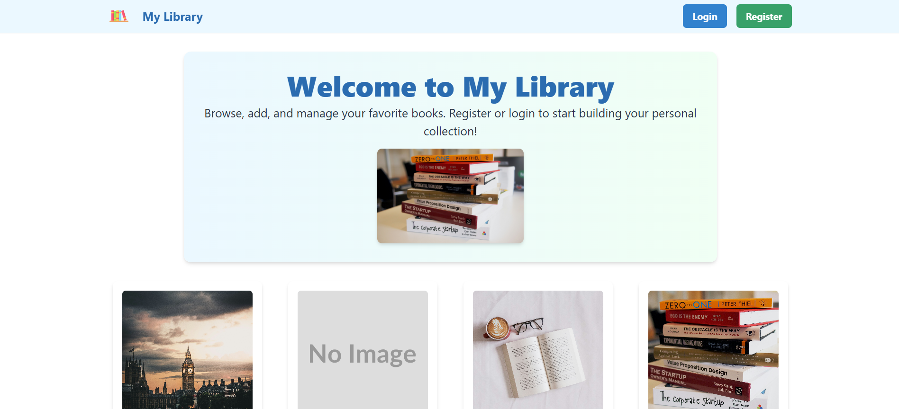

# My Library – Full Stack Book Library Management App



## Overview

My Library is a modern, full-stack web application for managing your personal book collection. Users can browse a public library, register/login, and curate their own "My Books" shelf with reading status and ratings. The project demonstrates best practices in React, Node.js, Express, and MongoDB, with a clean, responsive UI.

---

## Features

- User registration, login, and authentication (JWT, cookies)
- Browse a public library of books
- Add books to your personal "My Books" collection
- Update reading status (Want to Read, Currently Reading, Read)
- Rate books in your collection
- Responsive, modern UI (Chakra UI, custom CSS)
- RESTful API backend with error handling
- Demo data and easy local setup

---

## Tech Stack

**Frontend:**
- React 19, Vite, React Router, Axios
- Chakra UI for components and styling

**Backend:**
- Node.js, Express, Mongoose (MongoDB ODM)
- JWT for authentication, cookie-based sessions
- dotenv for environment variables

**Database:**
- MongoDB (with demo JSON file for local development)

---

## Folder Structure

```
booksLibraryManagementApp/
├── backend/
│   ├── books.json                # Demo book data
│   ├── db.json                   # Demo user/myBooks data
│   ├── .env                      # Backend environment variables
│   ├── server.js                 # Express server entry point
│   ├── seed.js                   # Script to seed books
│   ├── cleanMyBooks.js           # Script to clean user books
│   ├── controllers/              # Route controllers
│   ├── middleware/               # Auth & error middleware
│   ├── models/                   # Mongoose models
│   ├── routes/                   # API route definitions
│   └── MyLibrary.postman_collection.json # Postman API collection
├── frontend/
│   ├── index.html                # App entry HTML
│   ├── package.json              # Frontend dependencies
│   ├── vite.config.js            # Vite config
│   ├── public/                   # Static assets
│   └── src/
│       ├── App.jsx               # Main app component
│       ├── main.jsx              # Entry point
│       ├── index.css             # Global styles
│       ├── api/                  # Axios client
│       ├── components/           # UI components
│       ├── context/              # React Context providers
│       └── pages/                # Page components (Home, Login, Register, MyBooks)
└── app-desktop-view.png          # Desktop view screenshot
```

---

## Getting Started

### Prerequisites
- Node.js (v18+ recommended)
- npm or yarn
- MongoDB Atlas account (or local MongoDB)

### 1. Clone the Repository
```sh
git clone <repo-url>
cd booksLibraryManagementApp
```

### 2. Setup Environment Variables

Create `.env` files in both `backend/` and `frontend/` (see provided `.env` examples):

**backend/.env**
```
PORT=5000
MONGODB_URI=<your-mongodb-uri>
JWT_SECRET=<your-jwt-secret>
CLIENT_URL=http://localhost:3000
```

**frontend/.env** (optional, for proxy/config)
```
PORT=3000
VITE_API_URL=http://localhost:5000/api
```

### 3. Install Dependencies
```sh
cd backend && npm install
cd ../frontend && npm install
```

### 4. Seed Demo Data (Optional)
```sh
cd ../backend
node seed.js
```

### 5. Run the App

**Start Backend:**
```sh
cd backend
npm run dev
```

**Start Frontend:**
```sh
cd frontend
npm run dev
```

Visit [http://localhost:3000](http://localhost:3000) in your browser.

---

## API Endpoints

All endpoints are prefixed with `/api`.

### Auth
- `POST   /api/auth/register` – Register new user
- `POST   /api/auth/login` – Login
- `GET    /api/auth/logout` – Logout
- `GET    /api/auth/me` – Get current user (auth required)

### Books
- `GET    /api/books` – List all books

### My Books (auth required)
- `GET    /api/mybooks` – List user's books
- `POST   /api/mybooks/:bookId` – Add book to My Books
- `PATCH  /api/mybooks/:bookId/status` – Update reading status
- `PATCH  /api/mybooks/:bookId/rating` – Update rating

---

## How It Works

1. **Landing Page:**
   - Welcome message, desktop preview, and options to login/register.
2. **Authentication:**
   - Secure registration and login with JWT/cookies.
3. **Browse Books:**
   - View all available books with cover, title, and author.
4. **My Books:**
   - Add books to your collection, update status/rating, and manage your shelf.
5. **API:**
   - RESTful endpoints for all core actions, with error handling and authentication.

---

## Demo Credentials

- Register a new account or use demo credentials (if seeded):
  - Email: `user@example.com`
  - Password: `password123`

---

## Contributing

Contributions, issues, and feature requests are welcome! Please open an issue or submit a pull request.

---